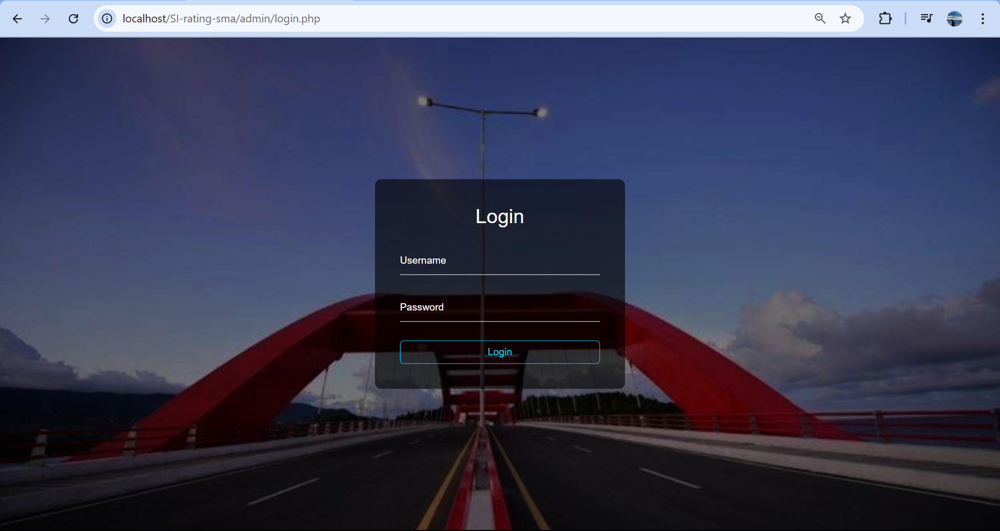
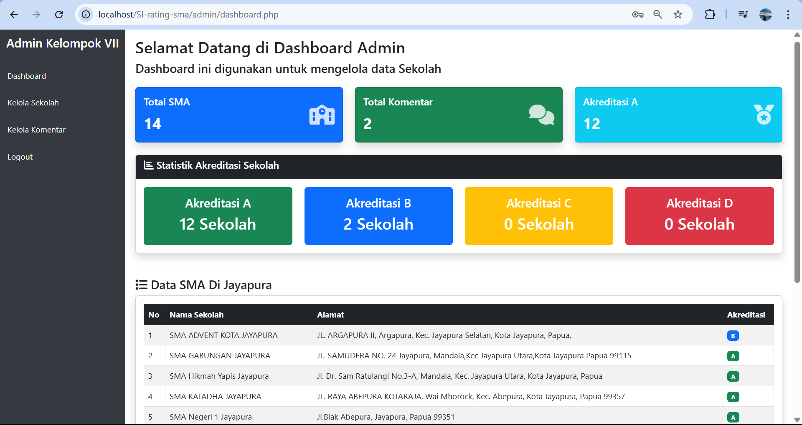
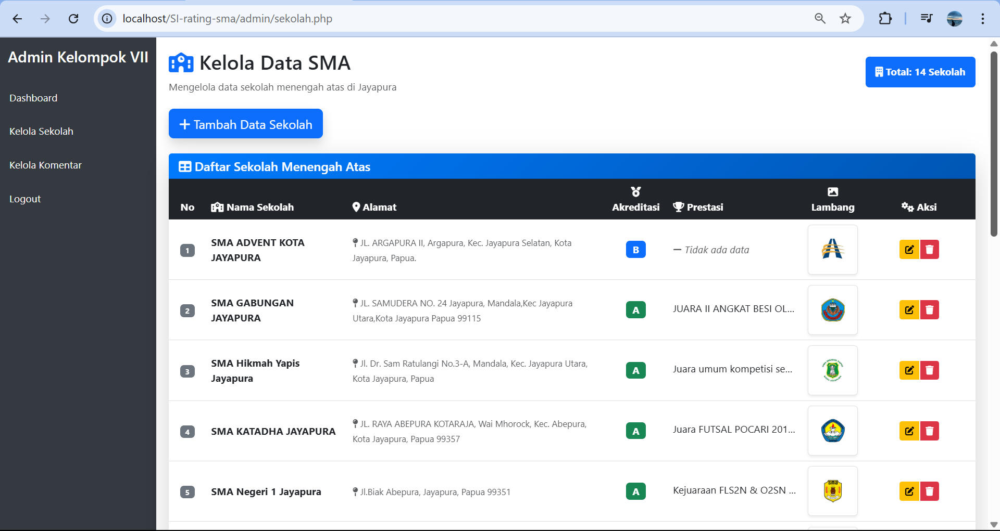
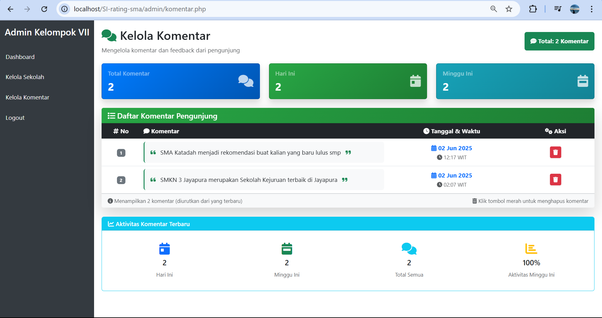
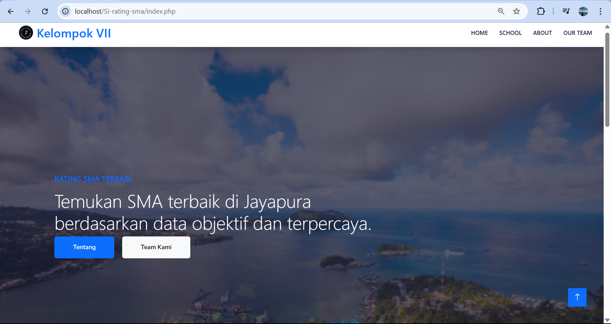
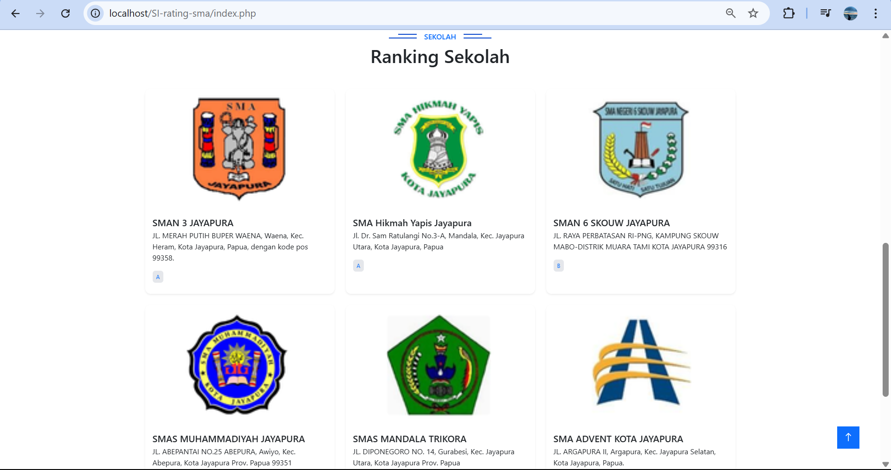
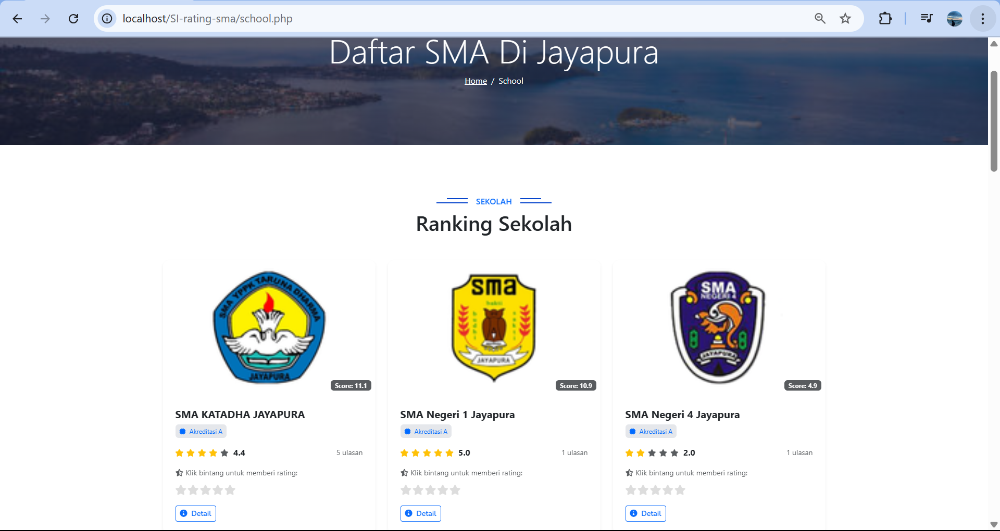
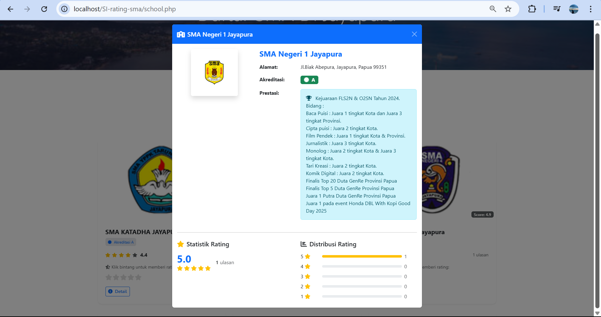

# SI-Rating-SMA
Tugas Manajemen Proyek - Sistem Informasi Rating Sekolah di Kota Jayapura
# Deskripsi Singkat
Website Rating SMA di Jayapura ini merupakan website yang dibangun dengan tujuan agar masyarakat dapat menilai SMA terbaik di wilayah Jayapura. Data-data yang dimasukan merupakan data resmi yang di dapatkan dari website SMA tersebut, jika ada kesalahan dalam menginput data mohon di maafkan. Terima Kasih!!
# Halaman Login

# Halaman Dashboard

# Halaman Kelola Sekolah

# Halaman Kelola Komentar

# Halaman Home

# Halaman Preview Sekolah

# Halaman Rating SMA

# Tampilan Detail SMA
